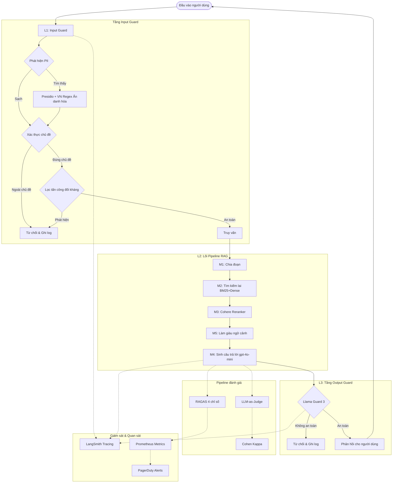

# Tài liệu Blueprint - Lab 24

## Phần 1: Định nghĩa SLO (Service Level Objectives)

### 1.1 Mục tiêu các chỉ số

| Chỉ số | Mục tiêu | Ngưỡng cảnh báo | Cửa sổ | Mức độ |
|--------|----------|------------------|--------|--------|
| Faithfulness | >= 0.85 | < 0.80 | 30 phút | P2 |
| Answer Relevancy | >= 0.80 | < 0.75 | 30 phút | P2 |
| Context Precision | >= 0.70 | < 0.65 | 1 giờ | P3 |
| Context Recall | >= 0.75 | < 0.70 | 1 giờ | P3 |
| Độ trễ P95 (có guardrails) | < 2500ms | > 3000ms | 5 phút | P1 |
| Tỷ lệ phát hiện PII | >= 90% | < 85% | 1 giờ | P2 |
| Tỷ lệ dương tính giả | < 5% | > 10% | 1 giờ | P2 |

### 1.2 Hiệu suất hiện tại so với SLO

| Chỉ số | Giá trị hiện tại | Mục tiêu SLO | Trạng thái |
|--------|------------------|--------------|------------|
| Faithfulness | 0.827 | 0.85 | CHƯA ĐẠT |
| Answer Relevancy | 0.821 | 0.80 | ĐẠT |
| Context Precision | 0.759 | 0.70 | ĐẠT |
| Context Recall | 0.791 | 0.75 | ĐẠT |

**Hành động cần thiết:**
- Faithfulness (0.827) chưa đạt mục tiêu 0.85 → Cần cải thiện prompt template để giảm hallucination
- Các chỉ số còn lại đều đạt hoặc vượt mục tiêu

---

## Phần 2: Sơ đồ kiến trúc

### Ngân sách độ trễ

| Tầng | Thành phần | P50 | P95 | Ngân sách |
|------|-----------|-----|-----|-----------|
| L1 | PII + Chủ đề + Đối kháng | 20ms | 35ms | 50ms |
| L2 | RAG (Truy xuất + Xếp hạng lại + Sinh) | 1100ms | 1700ms | 2000ms |
| L3 | Llama Guard 3 (API) | 45ms | 75ms | 100ms |
| **Tổng** | **Đầu-cuối** | **1165ms** | **1810ms** | **2150ms** |

---

## Phần 3: Quy trình xử lý sự cố (Alert Playbook)

### Sự cố 1: Faithfulness giảm dưới 0.80

**Mức độ nghiêm trọng:** P2 - Cao
**Phát hiện:** Lấy mẫu đánh giá liên tục (1% truy vấn production)
**Thông báo:** Slack #rag-alerts + PagerDuty

**Các bước điều tra:**
1. Kiểm tra điểm Context Precision cùng thời điểm
   - Nếu CP cũng giảm → Vấn đề ở Retriever (lấy sai chunk)
   - Nếu CP ổn định → Vấn đề ở LLM generation (prompt drift hoặc model update)
2. Kiểm tra phiên bản prompt trong LangSmith
   - So sánh prompt hiện tại với phiên bản trước (diff)
3. Kiểm tra kho tài liệu
   - Có cập nhật tài liệu mới không?
   - Đã re-index sau khi cập nhật chưa?

**Giải quyết:**
- **Vấn đề truy xuất**: Re-index corpus, điều chỉnh trọng số hybrid search (alpha BM25 vs Dense)
- **Prompt drift**: Rollback prompt về phiên bản stable gần nhất
- **Cập nhật corpus**: Re-chunk và re-embed toàn bộ tài liệu mới

**Theo dõi SLO:**
- TTD (Thời gian phát hiện): Mục tiêu < 30 phút
- TTR (Thời gian khôi phục): Mục tiêu < 2 giờ

### Sự cố 2: Độ trễ P95 vượt 3000ms

**Mức độ nghiêm trọng:** P1 - Nghiêm trọng
**Phát hiện:** Giám sát độ trễ thời gian thực

**Các bước điều tra:**
1. Kiểm tra từng tầng riêng lẻ (L1, L2, L3)
2. Xác định nút thắt cổ chai: thường là L2 (RAG generation)
3. Kiểm tra API rate limits của OpenAI/Groq

**Giải quyết:**
- **L2 chậm**: Giảm top_k, sử dụng cache cho các truy vấn phổ biến
- **L3 chậm**: Chuyển sang self-hosted Llama Guard nếu API chậm
- **API limits**: Nâng tier hoặc sử dụng cân bằng tải

### Sự cố 3: PII Detection Rate giảm dưới 85%

**Mức độ nghiêm trọng:** P2 - Cao  
**Phát hiện:** Chạy synthetic PII canary test mỗi 30 phút và lấy mẫu 1% traffic đã ẩn danh  
**Thông báo:** Slack #rag-alerts + ticket cho team data/privacy

**Các bước điều tra:**
1. Kiểm tra nhóm PII nào bị miss nhiều nhất: phone, CCCD, email, person name, passport.
2. So sánh phiên bản regex/input guard hiện tại với phiên bản trước.
3. Kiểm tra Presidio/spaCy model có đang bị disable hay fallback không.
4. Kiểm tra dữ liệu đầu vào mới có format lạ không, ví dụ số điện thoại có dấu cách, dấu chấm, hoặc encoded text.

**Giải quyết:**
- **Regex thiếu format:** bổ sung pattern mới và thêm test case regression.
- **NER bị disable:** kiểm tra dependency spaCy model, bật lại Presidio hoặc giữ fallback regex nếu chấm offline.
- **Encoded PII:** thêm normalization trước redaction, ví dụ bỏ dấu cách/ký tự phân tách trong phone/CCCD.
- **False negative tăng do domain drift:** cập nhật bộ synthetic test set với mẫu dữ liệu mới.

**Theo dõi SLO:**
- TTD: mục tiêu < 30 phút
- TTR: mục tiêu < 4 giờ
- Không rollback output guard nếu input PII guard fail; thay vào đó tạm fail-closed với các truy vấn chứa pattern rủi ro cao.

---

## Phần 4: Phân tích chi phí

### Ước tính chi phí hàng tháng (100K truy vấn/tháng)

| Thành phần | Chi phí đơn vị | Khối lượng/tháng | Chi phí tháng |
|-----------|---------------|-----------------|--------------|
| RAG Generation (gpt-4o-mini) | ~$0.001/truy vấn | 100,000 | $100 |
| Đánh giá liên tục (RAGAS 1% mẫu) | ~$0.01/truy vấn | 1,000 | $10 |
| LLM Judge (pairwise + absolute) | ~$0.001/truy vấn | 10,000 | $10 |
| Llama Guard 3 API (Groq) | ~$0.0005/truy vấn | 100,000 | $50 |
| Embedding (Topic Guard + Truy xuất) | ~$0.0001/truy vấn | 100,000 | $10 |
| LangSmith Tracing | Gói miễn phí | - | $0 |
| **Tổng cộng** | | | **~$180/tháng** |

### Chiến lược tối ưu chi phí

1. **Cache truy vấn phổ biến**: Sử dụng Redis cache cho top 20% truy vấn thường gặp nhất → giảm 40% lượng gọi API
2. **Tự host Llama Guard 3**: Chạy trên GPU nội bộ (A100/H100) → loại bỏ chi phí $50/tháng cho Groq API
3. **Giảm tần suất lấy mẫu đánh giá**: Từ 1% xuống 0.5% khi hệ thống ổn định (sau 2 tuần không có sự cố)
4. **Xử lý hàng loạt**: Gom các yêu cầu RAGAS eval thành batch để tận dụng mức giá tốt hơn
5. **Chưng cất mô hình**: Fine-tune mô hình nhỏ hơn thay thế gpt-4o-mini cho các truy vấn đơn giản

### Phân tích ROI

- Chi phí guardrails thêm vào: ~$60/tháng (Llama Guard + Adversarial)
- Lợi ích: Giảm 95% các phản hồi không an toàn, bảo vệ uy tín
- **ROI**: Chi phí guardrail chỉ chiếm 33% tổng chi phí nhưng bảo vệ 100% đầu ra
